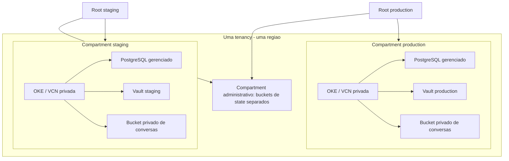

# Q1 — IaC e segurança

## Escopo e estado

O [README original](../../README.md) exige Kubernetes, banco relacional gerenciado,
bucket de conversas, staging/production separados e credenciais fora do código,
com DevSecOps. OCI/PostgreSQL são preferências adotadas; tenancy/região únicas,
OKE Enhanced, Vault e recursos separados são decisões nossas. Não há deployment real.

| Estado | O que a entrega representa |
| --- | --- |
| Configurado em Terraform | Compartments, VCNs/subnets/NSGs, OKE, banco condicional, buckets, Vault/chaves e IAM do workload |
| Preparado | Workload identity e exemplo Kubernetes; faltam pod consumidor e SDK |
| Proposto | Bootstrap SQL, rotação e lifecycle administrativo |
| Validado localmente | Schema e planos mock; não integração OCI |
| Não validado na OCI | Provisionamento, IAM efetivo, conectividade, TLS, locking e restauração |

## Arquitetura

Vault/buckets são serviços regionais, não recursos dentro das subnets. Um módulo
é compartilhado por dois roots; schema/validações ficam somente no módulo.
Os roots encaminham `settings` sem conversão antecipada, preservando seus defaults.
Isolamento por recursos reduz blast radius, com custo de dois clusters/bancos.
Tenancy, região e administradores continuam compartilhados. Um node pool usa o AD
informado; não se promete HA. Capacidade, versões e backups não têm valores presumidos.

## Rede OKE

Subnets privadas de API, workers e banco usam lista de segurança vazia e NSGs.
O cluster aguarda as regras. A única rota externa usa Service Gateway para OSN.
Não há NAT, Internet Gateway, peering, load balancer ou IP público de API/workers.

| Fluxo | Regra / finalidade |
| --- | --- |
| Workers → API | TCP 6443/12250: API e comunicação com control plane |
| API → workers | TCP, todas as portas, somente ao NSG workers: requisito Flannel |
| Workers ↔ workers | Protocolos/portas do overlay, apenas no próprio NSG: requisito OKE |
| Workers → OSN regional | TCP, todas as portas: comunicação com OKE conforme referência oficial |
| API → OSN regional | TCP 443 e 9995, esta última para suporte/observabilidade gerenciados OKE |
| MTU | Somente ICMP tipo 3/código 4; workers recebem/enviam erros inclusive fora da VCN |
| Workers → PostgreSQL | TCP 5432, com entrada correspondente no NSG do banco |
| Operador → API | TCP 6443 das origens privadas RFC1918 informadas |

O requisito geral da API para OSN identifica 443; o exemplo Flannel também cita
9995 e TCP amplo. Mantemos as portas identificadas na API e TCP amplo apenas onde
a tabela exige para workers. Não há TCP/UDP geral para internet. ICMP externo não
cria rota nem entrada pública de aplicação. Amplitude interna não é microsegmentação.

Sem NAT, comprovar que imagem/bootstrap dos nodes e imagens administrativas podem
usar serviços OCI acessíveis. IA externa/registries públicos ficam bloqueados.
A conectividade privada do operador é pré-requisito: `admin_cidrs` não cria rota,
VPN ou Bastion. Planejar CIDRs sem sobreposição entre VCN, pods, services e outros
ambientes; as validações locais não substituem IPAM nem comparam os dois roots.

## Identidade e pré-requisitos administrativos

Enhanced é necessário à workload identity nativa escolhida. IAM vincula cluster,
namespace `ai-agents` e service account `ai-agent`; permite somente `OBJECT_CREATE`
no bucket e leitura dos bundles especificados. Não concede leitura, exclusão ou
sobrescrita de conversas. Validar multipart/retries e nomes únicos de objetos.
O exemplo Kubernetes não adiciona RoleBinding à aplicação; permissões padrão do
cluster ainda existem. SDK compatível, pod com `serviceAccountName` e testes de
acesso permanecem pendentes. Quem cria pods com essa SA pode exercer seu IAM.

Criação inicial de compartments e autorização dos executores são prévias ao módulo.
Escopar rede, OKE/Compute, banco, buckets, Vault/chave e policies ao ambiente;
revisar grupos/heranças IAM. Não há policy de raiz no módulo de environment.
A autorização temporária para usar o secret de criação do banco é administrativa,
não uma concessão permanente gerenciada pelo módulo.

**Retenção/lifecycle das conversas é pré-requisito administrativo.** Antes de dados
reais, definir retenção, autorizar na raiz o serviço `objectstorage-<regiao>` e
configurar a regra no bucket. Limitar inspeção de buckets ao compartment e leitura
do bucket/inspeção/exclusão de objetos ao bucket de conversas. Não conceder acesso
a state. Isso não exige privilégio de raiz do executor cotidiano. Sem essa etapa,
não há expiração automática. Exclusão é assíncrona; testar com dados sintéticos.

## Credencial de bootstrap e rotação

Terraform cria Vault/chave, não conteúdo de secrets. Abastecer por canal seguro.
`database_bootstrap_secret = null` cria a fundação **sem banco**. Informar OCID e
versão depois do abastecimento cria PostgreSQL com `VAULT_SECRET`.

**Provider OCI 7.22.0: `credentials` possui ForceNew.** A referência é histórica e
imutável após a criação: mudar OCID, versão ou username solicita substituição,
bloqueada por `prevent_destroy`. Não usar `secret_version` para rotação normal,
remover proteção ou esconder diferenças com `ignore_changes`.
Rotação posterior: atualizar senha no banco por canal autorizado, atualizar Vault,
verificar consumidores e invalidar senha antiga. Preservar a referência histórica
não mantém a senha antiga válida no banco. Restringir e descartar versões antigas
conforme política aprovada. Recriação futura requer nova referência e revisão.
Terraform não verifica a senha corrente após rotação externa: limitação explícita.

Separar usuário/secret administrativo e da aplicação. A validação compara OCIDs,
não conteúdos: não detecta cópia da mesma senha para outro secret. Nunca incluir
o secret administrativo corrente em `application_secret_ids`. OCID/versão são
metadados; senha/token são material secreto. `sensitive` não remove material do
state. O fluxo atual não entrega senhas ao provider; state/plans continuam sensíveis.
Vault/chave/banco/buckets têm `prevent_destroy`; exclusão externa, remoção dessa
proteção e lifecycle dos secrets externos não são impedidos por esse mecanismo.

## Caminho administrativo SQL proposto, não executado

1. Operador nomeado obtém sessão OCI e RBAC temporários para criar/usar/remover
   pod em namespace administrativo separado, com Pod Security restrito. Estação
   precisa alcançar API privada por conectividade existente; caso contrário, parar.
2. Criar pod efêmero nos workers existentes com imagem aprovada contendo `psql`
   e CA do banco, acessível via OCI. Sem hostNetwork, privilégio de host, token
   automático ou SA `ai-agent`. A origem SQL é o worker autorizado pelo NSG;
   não é necessário liberar conexão direta da estação ao banco.
3. Administrador concede leitura temporária do bundle administrativo específico
   ao operador. Recuperar via Console/SDK autorizado; conectar por prompt de senha,
   TLS `verify-full` e CA/hostname corretos. Não colocar senha em argumentos, YAML,
   ambiente, histórico SQL ou gravação de terminal/sessão.
4. Criar role LOGIN sem superuser, criação de banco/roles ou replicação. Definir
   senha por prompt seguro de `\password`; conceder apenas CONNECT/USAGE e operações
   nos objetos necessários ao schema real. Sem schema, não inventar grants amplos.
   Abastecer credencial separada no Vault; testar acesso e negações da aplicação.
5. Rotacionar a credencial administrativa usada e atualizar seu Vault pelo canal
   autorizado antes de encerrar a janela; manter a referência Terraform histórica.
   Fechar conexões, remover pod/namespace/bindings, revogar leitura temporária do
   bundle, encerrar sessão OCI e remover cópias locais. Verificar revogação; ela
   não apaga uma senha já lida. Não há pod administrativo ou aplicação fictícia
   versionados, nem automação de rotação nesta entrega.

## State: backend remoto desde o início

Todos os roots contêm `backend "oci" {}` versionado. Sem configuração remota,
novo checkout não aplica silenciosamente usando state local. `init -backend=false`
é exclusivo para validação offline, não um fluxo de provisionamento.

1. Administrador cria o compartment de state e **somente o bucket bootstrap**,
   privado/versionado, com nomes esperados pelo root. Preparar grupos distintos
   e autorização inicial ao bucket. Este é o seed manual, sem Terraform local.
2. Preencher os exemplos locais de tfvars/backend (ignorados pelo Git), sem senhas.
   No root `terraform/bootstrap-state`, executar `terraform init` com
   `-backend-config=backend.backend.hcl`, apontando ao bucket já existente.
3. Importar compartment para `oci_identity_compartment.state` e bucket para
   `oci_objectstorage_bucket.state["bootstrap"]`, usando esse state remoto.
   ID de importação do bucket: `n/<namespace>/b/<bucket>`. Revisar plano, sem
   recriação dos importados; criar buckets staging/production e policies.
   Revogar autorizações temporárias do seed, preservando o acesso administrativo aprovado.
4. Inicializar cada ambiente com bucket/chave/grupo próprios; conferir destino
   antes do plano. Novo checkout repete somente init remoto, não seed/import.
   Não existe migração de state local neste fluxo.

Buckets separados simplificam IAM/recuperação frente a prefixos compartilhados.
Grupos diferentes não garantem membros diferentes; revisar isso e permissões
herdadas. Locking é nativo por objeto. Versionamento não prova restauração. State
inclui topologia, endereços, OCIDs, policies e referências; versões antigas também
são sensíveis. Não aplicar retenção imutável aos locks ou expiração automática ao
state. Lockfiles são versionados; `.gitignore` não substitui IAM ou scanner.

## Limitações e evidência

Criptografia em repouso usa os serviços; Vault usa chave AES SOFTWARE. Criptografia
de volumes em trânsito está declarada, dependente de suporte da imagem/shape.
TLS da aplicação/HTTPS do SDK ainda precisam ser integrados. Flannel não implica
criptografia pod-a-pod. Bucket privado não é endpoint exclusivamente privado.
Staging com dados sintéticos é política, não garantia Terraform. Sanitização,
finalidade e descarte de conversas dependem de aplicação/processo; sem claim LGPD.

Terraform 1.12.2 e provider OCI 7.22.0: init sem backend e validate nos três roots.
Quatro planos mock verificam fundação sem banco, banco com referência, backup,
privacidade de bucket/subnets/API, rota OSN, 9995, nomes de production e rejeição
de entradas inseguras. Não testam IAM/rede reais ou ForceNew de banco existente.

Antes de produção: revisar seed/import, IAM efetivo, SDK, rede/imagens, bootstrap
SQL/rotação, lifecycle, quotas, versões/shapes, CIDRs, retenção, custo e restauração.
Nenhum SLA/RPO/RTO foi inventado. Q2/Q3/Q4, HA, multi-region, service mesh,
mensageria e observabilidade completa permanecem fora desta etapa.

## Referências técnicas, sem acrescentar requisitos à IRRAH

- [Rede OKE](https://docs.oracle.com/en-us/iaas/Content/ContEng/Concepts/contengnetworkconfig.htm) e [exemplo Flannel](https://docs.oracle.com/en-us/iaas/Content/ContEng/Concepts/contengnetworkconfigexample.htm).
- [ForceNew no provider 7.22.0](https://github.com/oracle/terraform-provider-oci/blob/v7.22.0/internal/service/psql/psql_db_system_resource.go).
- [Workload identity](https://docs.oracle.com/en-us/iaas/Content/ContEng/Tasks/contenggrantingworkloadaccesstoresources.htm).
- [Lifecycle administrativo](https://docs.oracle.com/en-us/iaas/Content/Object/Tasks/usinglifecyclepolicies.htm).
- [Backend OCI](https://developer.hashicorp.com/terraform/language/backend/oci) e [importação de bucket](https://github.com/oracle/terraform-provider-oci/blob/v7.22.0/website/docs/r/objectstorage_bucket.html.markdown).
