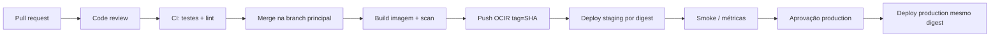

# Q2 — CI/CD e deploy sem downtime

## Escopo e estado

O [README original](../../README.md) pede pipeline com **code review**, **testes**,
**build**, **zero downtime** no Kubernetes, **mitigação de risco** na atualização e
**rollback rápido**. O enunciado aceita **desenhar ou descrever**; GitHub Actions,
GitLab CI ou Jenkins são opções equivalentes.

Este repositório contém a **infraestrutura da Q1** (Terraform OCI/OKE), não o
microsserviço de WhatsApp. **Não há** Dockerfile, código da aplicação, testes de
aplicação, OCIR configurado, trust OIDC GitHub→OCI nem conectividade executável ao
OKE privado. Por isso:

| Artefato | O que representa |
| --- | --- |
| [`.github/workflows/ci.yml`](../../.github/workflows/ci.yml) | Verificações **reais** sobre o Terraform da Q1 |
| [`.github/workflows/release.yml`](../../.github/workflows/release.yml) | **Referência** para gates de uma futura promoção por digest (`workflow_dispatch`); **não promove** artefato |
| Este documento | Pipeline alvo, estratégia K8s, rollback, pré-requisitos e etapas **não implementadas** aqui |

**Não foi executado** build de imagem, push para registry nem deploy no cluster.

## Requisitos IRRAH vs decisões desta entrega

| Tema | Exigência IRRAH | Decisão nesta entrega |
| --- | --- | --- |
| Code review | Stage obrigatória | Proteção de branch + PR (processo GitHub); CI roda em `pull_request` |
| Qualidade (testes) | Stage obrigatória | Neste repo: `terraform test` (Q1). No repo da app: testes unitários/integração |
| Build | Stage obrigatória | Neste repo: **não aplicável**. No repo da app: build de imagem container |
| Zero downtime K8s | Sim | Rolling Update documentado abaixo |
| Rollback rápido | Sim | Redeploy do digest anterior conhecido (documentado) |
| Ferramenta CI | Actions, GitLab ou Jenkins | GitHub Actions |

Decisões adicionais (não exigidas pelo README, alinhadas ao cenário crítico):

- Dois workflows: **CI** (validação contínua) e **Release** (gates de referência).
- **OCIR** como registry de referência; tag por **commit SHA**; promoção por **digest** (somente documentada).
- **Mesmo digest** validado em staging antes de production (fluxo alvo no repo da app).
- **GitHub Environment** `production` com proteção — **proposta externa** (configuração no GitHub, não validada aqui).
- Identidade temporária preferida: **GitHub OIDC → OCI** (arquitetura-alvo; não executada neste repo).
- Sem Helm, ArgoCD/Flux, service mesh nem canary controller.
- Migrations de banco: padrão **expand/contract** quando houver schema (fora deste repo).

## Relação com a Q1

A Q1 provisiona **dois clusters OKE** (staging e production) com **endpoint de API
privado**, sem NAT/Internet Gateway para workers. Implicações para CI/CD:

- Runners do GitHub **não alcançam** a API do cluster sem VPN, bastion, runner
  self-hosted na VCN ou pipeline interno equivalente — **pré-requisito externo**.
- Workload identity OCI (Q1) cobre pods no cluster; **não substitui** credenciais do
  pipeline para push OCIR/`kubectl`.
- Ingress/LB da aplicação WhatsApp **não** faz parte do Terraform da Q1.

## Pipeline alvo (repositório real da aplicação)

### Code review

Revisão humana via PR; status checks obrigatórios incluindo o job de CI. Nenhum
deploy a partir de fork não confiável com secrets de ambiente.

### CI neste repositório de challenge

O [`ci.yml`](../../.github/workflows/ci.yml) executa apenas:

- `terraform fmt -check -recursive` em `terraform/`;
- `terraform init -backend=false` + `validate` nos roots `bootstrap-state`, `staging` e `production`;
- `terraform test` no root staging (planos mock da Q1).

**No repositório da aplicação**, o mesmo estágio CI incluiria testes da aplicação e,
após merge, o estágio de build produziria a imagem antes da publicação no registry.
Essas etapas **não foram simuladas** aqui (sem jobs skipped ou build fictício).

### Build e publicação (não implementados neste repo)

Etapas que ficam **somente documentadas**:

1. Build da imagem a partir do Dockerfile da aplicação (commit mergeado).
2. Tag imutável: SHA do Git (`:${{ github.sha }}`) e registro do **digest** retornado pelo push.
3. Push para **OCIR** com autenticação via **OIDC** (sem senha estática de longa duração).
4. Scan de vulnerabilidades na esteira (alinha cultura DevSecOps; detalhe operacional).

### Release neste repositório

O [`release.yml`](../../.github/workflows/release.yml) é **workflow de referência para
gates de uma futura promoção por digest**. **Não promove** imagem nem altera cluster.

- Disparo **`workflow_dispatch`** apenas (evita execução acidental).
- Valida formato do digest e confirmação textual para production (barreira operacional
  **adicional**, não substituto de required reviewers).
- Jobs `staging-gate` / `production-gate` materializam **`environment:`** para modelar
  gates futuros; contêm apenas checkout — **sem** promoção, `docker push`,
  `oci ce cluster create-kubeconfig` ou `kubectl apply`.

Etapas de promoção/deploy **reais** (repo da app + infra pronta), descritas mas não codificadas:

1. Autenticar no OCIR (OIDC).
2. Verificar que o digest existe no registry (immutability).
3. Aplicar manifesto Deployment (ou patch de imagem por digest) no OKE de staging.
4. Aguardar rollout (`kubectl rollout status`) e checks de smoke.
5. Repetir em production **o mesmo digest**, após aprovação no Environment `production`.

Em operação contínua, staging poderia disparar automaticamente após merge; neste
challenge o release manual explicita o contrato sem integração OCI.

## Estratégia Kubernetes: Rolling Update

Estratégia escolhida: **`RollingUpdate`** nativo do Deployment (sem canary controller).

Parâmetros de referência (valores concretos dependem da aplicação; não versionamos
manifest fictício neste repo):

| Parâmetro | Valor de referência | Função |
| --- | --- | --- |
| `strategy.type` | `RollingUpdate` | Substituição gradual de pods |
| `maxUnavailable` | `0` | Impede que o RollingUpdate **planeje** indisponibilidade de réplicas abaixo do `replicas` desejado; **não garante** disponibilidade do serviço sozinho |
| `maxSurge` | `1` | No máximo um pod extra durante a troca |
| `readinessProbe` | Definida pela app | Tráfego só após a app aceitar requisições |
| `terminationGracePeriodSeconds` + `preStop` | Definidos pela app | Drenar conexões antes do SIGTERM |

**Contratos da aplicação** (não demonstráveis aqui): handler de shutdown gracioso,
probe de readiness que reflita dependências críticas (ex. fila/DB), e PDB se a carga
exigir garantia mínima de réplicas.

### Mitigação de risco aos clientes

- Rollout só avança enquanto novos pods passam na readiness (depende de probe correta).
- `maxUnavailable: 0` impede indisponibilidade **planejada** de réplicas pelo controller
  abaixo do número desejado; ainda exige **capacidade** para `maxSurge`, novos pods
  atingirem **Ready** e comportamento correto da aplicação (graceful shutdown, filas, DB).
  **Não promete** zero downtime comprovado neste challenge.
- Monitorar taxa de 5xx e latência durante e após o deploy; critério de abort documentado
  no runbook (rollback abaixo).
- Migrations **expand/contract**: compatibilizar schema antes de trocar código que depende
  de colunas novas; evita rollback de imagem incompatível com estado do banco.

## Rollback

1. Manter registro do **último digest estável** por ambiente (release notes, tag Git ou
   tabela operacional).
2. Ante anomalia: redeploy do Deployment com o **digest anterior** (mesmo mecanismo da
   promoção, input manual ou job de rollback).
3. `kubectl rollout undo` só é seguro se o controller ainda tiver Revision anterior
   equivalente; **digest pinado** é a fonte de verdade preferida.
4. Se a release incluiu migration **contract**, rollback de imagem pode exigir plano de
   dados — expand/contract reduz esse risco; não prometer rollback automático de schema.

## Identidade e secrets (arquitetura-alvo, não executada)

- **GitHub → OCI:** federated credential (OIDC) com claims restritos (`repo`, `environment`).
- Policies OCI mínimas: push apenas no repositório OCIR da app; `kubectl`/OKE apenas no
  compartment/cluster do ambiente alvo.
- Sem kubeconfig estático no repositório; secrets de aplicação continuam fora do Git (Vault Q1).
- Permissão `id-token: write` no workflow: conceder **somente** quando existir job real de
  autenticação federada (ex. login OCIR/OKE via OIDC), preferencialmente no **menor escopo**
  possível (job ou workflow que autentica, não globalmente por hábito). O [`release.yml`](../../.github/workflows/release.yml)
  **não** solicita `id-token` porque não autentica na OCI.

## GitHub Environments (proposta externa, não validada)

Configuração **proposta** e **externa** ao código versionado:

- Criar environments `staging` e `production` na UI/API do GitHub.
- `environment: production` (e `staging`) no YAML **apenas referencia** o nome do Environment;
  **required reviewers**, protection rules, secrets e variables precisam ser configurados
  **externamente** no repositório.
- O input `confirm_production` do `workflow_dispatch` é barreira operacional no workflow;
  **não substitui** required reviewer configurado no Environment.
- **Nenhuma** aprovação obrigatória de Environment foi configurada nem validada neste challenge.

## Limitações desta entrega

- Nenhum deploy real, push OCIR ou teste de conectividade OKE.
- CI **não** substitui testes/build da aplicação WhatsApp.
- Rolling Update e probes descritos **sem** Deployment de exemplo (evita imagem/porta/health inventados).
- Q3/Q4 permanecem fora deste escopo.

## Referências (sem acrescentar requisitos à IRRAH)

- [GitHub Actions environments](https://docs.github.com/en/actions/deployment/targeting-different-environments/using-environments-for-deployment)
- [GitHub OIDC with cloud providers](https://docs.github.com/en/actions/deployment/security-hardening-your-deployments/configuring-openid-connect-in-cloud-providers)
- [Kubernetes Rolling Update](https://kubernetes.io/docs/tutorials/kubernetes-basics/update/update-intro/)
- [Expand and Contract](https://martinfowler.com/bliki/ParallelChange.html)
